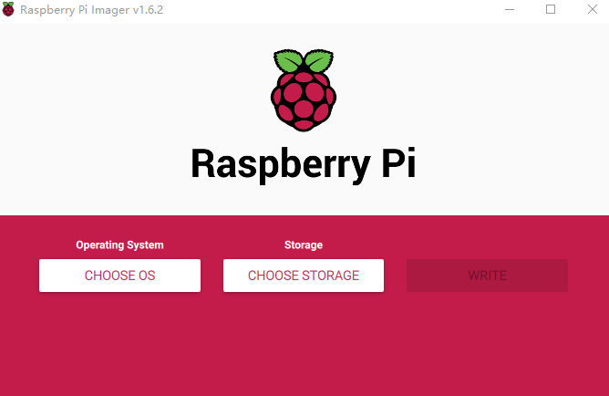

# 系统安装

### 硬件  
某宝、某东、某鱼都可， 记得看有没有配 sd 卡， 电源，外壳啥的，内存16g 起步吧， 虽然8g 也能用。  
 
### 系统安装

官方教程：https://www.raspberrypi.com/documentation/  

一些教程比较老了， 还以NOOBS为例， 英文文档配合谷歌翻译其实也差不多了。  
以下是在window 系统安装树莓派系统的简单流程：  
1、读卡器、SD 卡， 一会安装的时候会格式化，有重要文件的记得备份。  
2、下载 Raspberry Pi Imager   &nbsp;&nbsp;   [下载链接](https://www.raspberrypi.com/software/)  
3、下载系统， 官方推荐：https://www.raspberrypi.com/software/operating-systems/  
4、在window系统安装Raspberry Pi Imager，运行，选择所下载的镜像，SD 卡； 写入系统（时间稍长，其实和做启动盘差不多）

5、把SD卡插入树莓派， 接通电源即可
